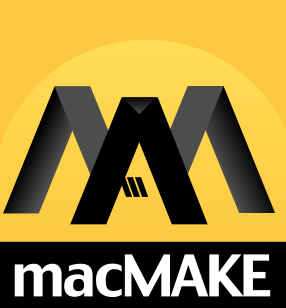

**This project is developed with the assistance of an LLM**

# macMAKE

<p align="center">
  
</p>

**macMAKE is a modern build environment for developing software for Classic Mac OS from Linux.**

It grew out of a simple problem: compiling Classic Mac software with a modern compiler is possible, but large historical Macintosh applications were built around much more than a compiler.

They depended on CodeWarrior project semantics, the Classic PowerPC ABI, CFM linking, PEF binaries, resource forks, historical runtime behavior, target membership, access paths, library ordering, and numerous assumptions that were normally invisible because CodeWarrior handled them.

macMAKE attempts to reproduce that environment on a modern host.

It is not a CodeWarrior emulator and it is not a frontend for Retro68. The goal is to understand what a CodeWarrior-era project means and reproduce the relevant build behavior directly.

> Retro68 asks: **How can modern GCC produce a Classic Mac program?**
>
> macMAKE asks: **What did CodeWarrior mean when it built this Classic Mac project, and how can we reproduce that behavior from Linux?**

## Why macMAKE exists

Classic Mac development currently has two especially important reference points.

**Metrowerks CodeWarrior** remains the historical standard. It provided an unusually complete Macintosh development environment and produced much of the software people still run on Classic Mac OS today. CodeWarrior 8 is an important behavioral reference for macMAKE: when ABI behavior, project semantics, object formats, libraries, or linker behavior are ambiguous, the question is often simply, "What did CodeWarrior do?"

**Retro68**, created by Wolfgang Thaller, demonstrated that modern GCC could successfully target both 68K and PowerPC Macintosh systems and brought modern cross-development techniques to machines that predate them by decades. It has been important prior art for macMAKE and was used during macMAKE's early development.

macMAKE approaches the problem from a different direction.

Rather than adapting historical applications to a new runtime and build model, macMAKE increasingly attempts to preserve the assumptions those applications originally made.

That distinction becomes important with large applications.

A small Toolbox program can exercise only a narrow portion of the historical development environment. A browser or other substantial CodeWarrior project can expose differences in structure alignment, calling conventions, runtime behavior, CFM imports, transition vectors, exception handling, library archives, relocation formats, and project dependency semantics.

macMAKE treats those differences as toolchain compatibility problems rather than application bugs.

## What macMAKE does

macMAKE is being developed as an end-to-end Classic PowerPC build environment.

Current work includes support for areas such as:

- CodeWarrior-style project and target semantics
- Large dependency graphs and workspaces
- Classic PowerPC ABI compatibility
- Historical Macintosh structure alignment
- CFM linking
- PEF generation
- CodeWarrior/MWOB library handling
- resource processing
- Classic Macintosh packaging
- compatibility with historical Macintosh libraries
- modern automated builds and testing from Linux

The project is being developed against real historical software rather than only synthetic examples. MacSurf has served as a large application target, while Classilla is being used to expose deeper CodeWarrior C++ runtime, linker, and library compatibility requirements.

Passing a compiler is not considered sufficient evidence of compatibility. Where possible, macMAKE uses small fixtures, binary inspection, comparison with historical CodeWarrior output, and runtime testing under Classic Mac OS to establish behavior.

## Development philosophy

macMAKE does not attempt to "modernize away" Classic Mac OS.

The target is still Classic Mac OS, with its own ABI, executable formats, runtime conventions, Toolbox APIs, resources, and limitations.

The modernization happens on the development side.

The long-term objective is that a developer should be able to work from a modern Linux system using modern source control, editors, storage, automation, and hardware while producing applications that behave like proper Classic Macintosh software.

In other words:

**modern workstation, historical target.**

## Current status

macMAKE is under active development and is not yet being presented as a finished replacement for CodeWarrior.

Substantial Classic PowerPC applications compile through increasingly large portions of the toolchain, and current work is focused on closing the remaining runtime, C++ ABI, library, relocation, and linker compatibility gaps exposed by real CodeWarrior-era software.

Early releases should be considered experimental.

Compatibility will expand as more applications are tested.

## Source availability

The macMAKE core is **proprietary software**.

This repository is the public home of the project, documentation, examples, issue tracking, and binary releases. It does **not** contain the proprietary macMAKE implementation.

macMAKE makes use of existing open-source software where appropriate. Source code and modifications that must be made available under the licenses of redistributed components are published separately in the [`macmake-gpl`](https://github.com/mplsllc/macmake-gpl) repository.

The presence of GPL-licensed components in the distributed toolchain does not mean that the proprietary macMAKE components are themselves released under the GPL.

See the licensing documentation accompanying each release for the exact components and licenses involved.

## Historical SDKs and libraries

macMAKE does not intend to redistribute proprietary Apple or Metrowerks development material without permission.

Some compatibility and historical-development workflows may require users to provide files from software they already possess, such as CodeWarrior libraries or Macintosh interfaces.

Where macMAKE can provide independently redistributable replacements or metadata, those can be distributed separately.

The project will document these requirements clearly as public releases develop.

## Prior art and acknowledgements

macMAKE would not exist without the work that came before it.

**Metrowerks CodeWarrior** is the primary historical reference for the environment macMAKE is attempting to understand and reproduce. Its compiler, project system, Macintosh libraries, linker, debugger, PowerPlant framework, and overall development environment defined an important era of Macintosh software development.

**Retro68**, by Wolfgang Thaller, demonstrated that GCC-based modern cross-compilation for vintage Macintosh systems is practical and provided important tooling, research, and prior art for both 68K and PowerPC Macintosh development. macMAKE began with Retro68 as part of its development path before progressively replacing pieces where stricter CodeWarrior compatibility was required.

Apple's **Macintosh Programmer's Workshop**, Universal Interfaces, the Classic Macintosh runtime and executable-format documentation, and the work of developers who preserved and documented these systems remain essential references.

The Classilla build system and the work of **Cameron Kaiser** are also important practical references for understanding the challenges involved in building very large CodeWarrior-era Macintosh applications.

macMAKE builds on decades of Macintosh development knowledge. It should not be confused with having invented the formats, APIs, ABIs, or techniques it implements.

## Releases

Binary releases will be published through this repository when macMAKE reaches a suitable public testing stage.

The intended workflow is ultimately simple:

```sh
macmake build
```

The complexity required to produce a correct Classic Macintosh application should belong in the toolchain, not in every individual project.

## Project links

- Website: https://macmake.dev
- Open-source component source: [`macmake-gpl`](https://github.com/mplsllc/macmake-gpl)
- Issues: use this repository's GitHub issue tracker

More documentation will be added as the first public release approaches.
